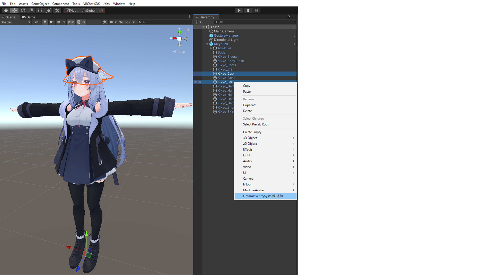
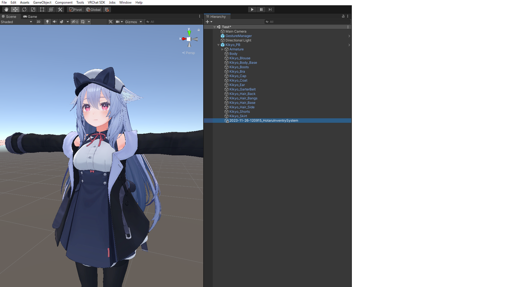

# Hotaru Inventry System

## 概要
MA対応のアバター編集ツールです。
オブジェクトオンオフアニメーションを手軽に作成できます。
[](
↓商品ページを貼る
boothでの配布ページは[こちら](https://hotaru86.booth.pm/)
)

## VCCへの導入
VCCをインストール済みなら、[https://hotaru86.github.io/VPM/](https://hotaru86.github.io/VPM/)にアクセスし、「Add to VCC」を押すことで、VCCのリストに追加できます。

[VPM CLI](https://vcc.docs.vrchat.com/vpm/cli/)を使用する場合は、コマンドラインで以下のコマンドを入力することでも、VCCのリストに追加できます。
```
vpm add repo https://hotaru86.github.io/VPM/index.json
```

## プロジェクトへの導入
本ツールを使用するには、Modular Avatarの導入が必須です。
事前に、[https://modular-avatar.nadena.dev/ja](https://modular-avatar.nadena.dev/ja)から導入を済ませておいてください。

本ツールを使用したいプロジェクトの「Manage Project」から、「Manager Package」に移動します。
VCCに導入済みのパッケージ一覧が表示されるので、HotaruInventrySystemの右にある「+」ボタンを押すか、「Installed version」からバージョンを選び、プロジェクトにインポートしてください。


※基本的に最新バージョン推奨です。

## 使い方
1. オンオフアニメーションを設定したいオブジェクトを右クリックし、「HotaruInventrySystemに追加」を押します。複数選択も可能です。(複数オブジェクトをまとめてオンオフするアニメーションが生成されます。)

2. 表示されたウィンドウ上で、グループ名と、デフォルトでオンにするかどうかを設定します。

3. 「アニメーションを作成」ボタンを押し、アバターの子に「(生成日時)_HotaruInventrySystem」というオブジェクトが生成されていれば完了です！
設定したアニメーションは、Expressionメニュー(Radialメニュー)から切り替えられます。

作成したアニメーションを削除したいとき、再設定したいときは、生成された「(生成日時)_HotaruInventrySystem」オブジェクトを削除してください。


