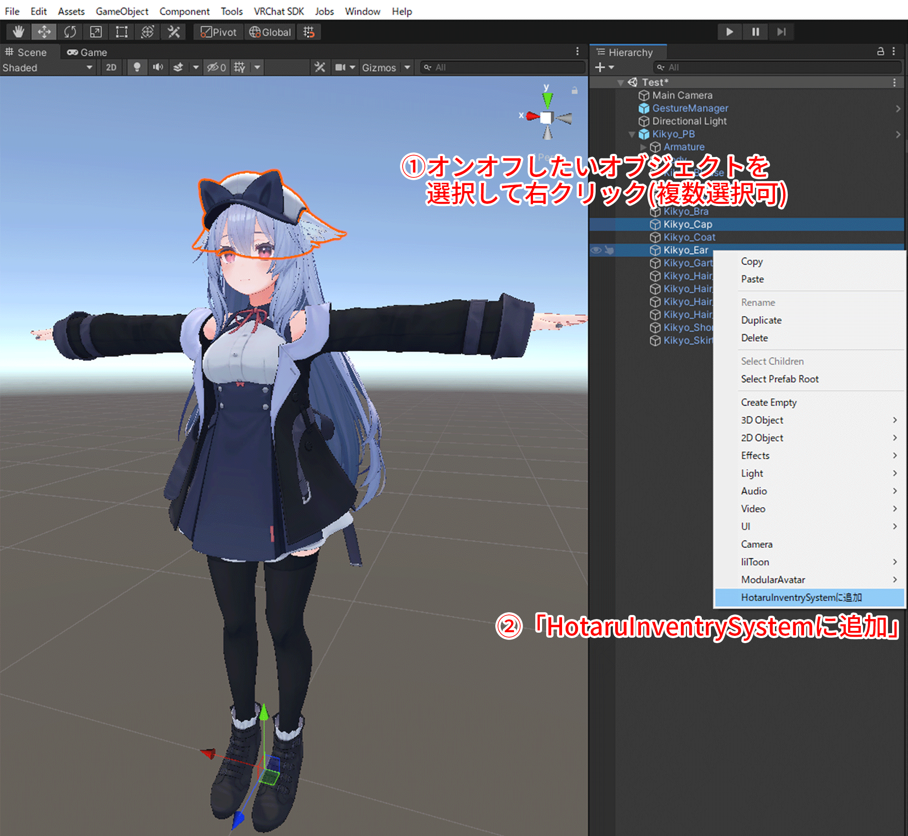

# Hotaru Inventry System

## 概要
MA対応のアバター改変用ツールです。
オブジェクトオンオフアニメーションを手軽に作成できます。
boothでの配布ページは[こちら](https://hotaru86.booth.pm/items/5289934)

## VCCへの導入
VCCをインストール済みなら、[https://hotaru86.github.io/VPM/](https://hotaru86.github.io/VPM/)にアクセスし、「Add to VCC」を押すことで、VCCのリストに追加できます。

[VPM CLI](https://vcc.docs.vrchat.com/vpm/cli/)を使用する場合は、コマンドラインで以下のコマンドを入力することでも、VCCのリストに追加できます。
```
vpm add repo https://hotaru86.github.io/VPM/index.json
```

## プロジェクトへの導入
本ツールを使用するには、Modular Avatarの導入が必須です。
事前に、[https://modular-avatar.nadena.dev/ja](https://modular-avatar.nadena.dev/ja)から、Modular AvatarをVCCに導入してください。

本ツールを使用したいプロジェクトの「Manage Project」から、「Manager Package」に移動します。
VCCに導入済みのパッケージ一覧が表示されるので、HotaruInventrySystemの右にある「+」ボタンを押すか、「Installed version」からバージョンを選び、プロジェクトにインポートしてください。

※基本的に最新バージョン推奨です。

## 使い方
1. オンオフしたいオブジェクトを選択し、右クリックします。(AとBを同時にオンオフしたい場合、AとBを同時選択して右クリック)
2. 「HotaruInventrySystemに追加」を押します。複数選択も可能です。(複数オブジェクトをまとめてオンオフするアニメーションが生成されます。)


3. 表示されたウィンドウ上で、グループ名、ワールド移動時の保存設定、初期状態の表示設定を設定します。


4. 上記の設定が完了した状態でアバターをアップロードすれば、Expressionメニュー(Radialメニュー)に設定が反映されます。


5. アバターの子に生成された「Hotaru Inventry System」のInspectorを開くか、Unity画面上部の「Tools > HotaruInventrySystem」を開いくことで、一度設定した内容を再度編集できます。


## 注意事項
- v2.0.0以降、アニメーションはアップロード(Playモード開始)のタイミングで生成されるようになっています。本ツールで生成したAnimationやAnimatorControllerを手動で編集したい場合、v1.0.8をご使用ください。
- 生成されたアニメーションが、アップロード後に「Assets/HotaruInventrySystem/tmp」に残る既知の不具合があります。今後のアップデートで修正予定です。Playモードに入った際には、tmpフォルダ内のデータはすべて削除されますのでご注意ください。

## 更新情報
- v1.0.0  リリース
- v1.0.1  ライセンスを明記
- v1.0.2  孫以下の子孫オブジェクトに設定ができないバグを修正
- v1.0.3  ビルド時にエラーが発生する問題を修正
- v1.0.4  軽微な修正
- v1.0.5  バージョン3.4.1のSDK-Avatarsでしか動作しない問題を修正
- v1.0.6  ツール内の誤字の修正
- v1.0.7  Unity Editor再起動時などに、AnimatorControllerのデータが消える問題を修正
- v1.0.8  Unity Editor再起動時などに、生成されたrootExMenu内のSubmenuAssetがNoneになる(参照が外れる)問題を修正
- v2.0.0  アニメーションの生成をアップロード時に実行するように変更。グループ内の各オブジェクトについてオンオフ状態を個別に設定できるように変更。設定を後から編集できるように変更。
- v2.0.1  オンオフ状態をワールド移動時に保存するかどうかを設定できるように変更
## ライセンス
[LICENSE](LICENSE.md)
